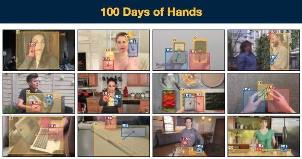
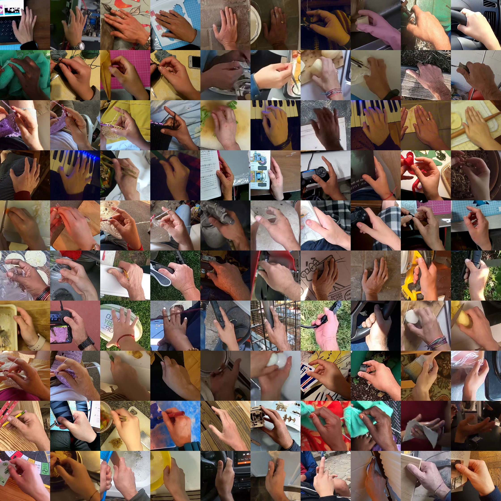

# Hand100M-SiMHand
Hand100M is a on-going project by [Nie Lin](https://lin-nie.github.io/). Now we support 2.0M similar hand label of [SiMHand](https://github.com/ut-vision/SiMHand) project to all public community. Thank you!


## Ego4D Data Download


Some of the data in our [SiMHand](https://github.com/ut-vision/SiMHand) project is based on [Ego4D-v1](https://ego4d-data.org/)'s video dataset implementation, but by license constraints, we are unable to disseminate the data twice. Please download the Ego4D dataset in [here](https://ego4d-data.org/). Thank you for the Meta Research's great job!
After dwonload, you can get:
```bash
ego4d/v1/
├── annotations
├──── ......
├── clips
├──── ......
├── full_scale  # (please use this one ✅)
├──── aa7e4a70-abda-4ef4-a1e0-5af5bda1e560.mp4
├──── ffa8e210-b20b-4a22-8b96-f21146cf9ab8.mp4
├──── ......
└── videos_224p
```

## Ego4D Data Process
Make sure the following dependencies are installed:
```bash
pip install tqdm
```

Also, ensure ffmpeg is installed on your conda environment:
```bash
sudo apt-get update
sudo apt-get install ffmpeg
```

Running the script:
```bash
python ego4d_process.py
```

## Annotations
Please download our pre-training data annotations of [Ego4D-v1](https://ego4d-data.org/) at [here](https://drive.google.com/drive/folders/1OC1X5iJsc8oMOOLw-UOZSzaNHzqP4LFg?usp=sharing).

**Note**: The [annotation](https://drive.google.com/drive/folders/1OC1X5iJsc8oMOOLw-UOZSzaNHzqP4LFg?usp=sharing) includes the file path for loading hand data. If modifications are needed, please either edit the corresponding JSON file or update the relevant JSON loading lines in the [62 line](https://github.com/ut-vision/SiMHand/blob/main/src/data_loader/ego4d_loader.py#L62), [77 line](https://github.com/ut-vision/SiMHand/blob/main/src/data_loader/ego4d_loader.py#L77), [108 line](https://github.com/ut-vision/SiMHand/blob/main/src/data_loader/ego4d_loader.py#L108) of [Ego4D dataloaders](https://github.com/ut-vision/SiMHand/blob/main/src/data_loader/ego4d_loader.py).

## 100DOH Data Download


Some of the data in our [SiMHand](https://github.com/ut-vision/SiMHand) project is based on [100DOH](https://fouheylab.eecs.umich.edu/~dandans/projects/100DOH/index.html)'s video dataset implementation, but still by the license constraints, we are unable to disseminate the data twice. Please download the 100DOH dataset in [here](https://ego4d-data.org/). Thank you for [Dandan Shan](https://ddshan.github.io/)'s great job! After dwonload, you can get:
```bash
100DOH/
├── 100doh_downloader.py
├── file
├──── meta_100DOH_video_copy.txt
├──── meta_100DOH_video.txt
├──── meta_100K_frame.txt
├──── README_100K.md
├──── test.json
├──── train.json
├──── trainval.json
├──── val.json
├──── ......
├── videos  # (please use this one ✅)
├──── Zz7k80JfRqI.mp4
├──── ZzNpWZmmt4k.mp4
├──── ......
```
## 100DOH Data Process
Make sure the following dependencies are installed:
```bash
pip install tqdm
```

Also, ensure ffmpeg is installed on your conda environment:
```bash
sudo apt-get update
sudo apt-get install ffmpeg
```

Running the script:
```bash
python 100doh_process.py
```

**Note**: Since the [100DOH](https://fouheylab.eecs.umich.edu/~dandans/projects/100DOH/index.html) videos are all sourced from YouTube, this means there is a risk of them becoming unavailable over time. If any videos are found to be inaccessible, please send me the names of the invalid videos via a text file at: [nielin@iis.u-tokyo.ac.jp](nielin@iis.u-tokyo.ac.jp). Thank you!


## Annotations
Please download our pre-training data annotations of [100DOH](https://fouheylab.eecs.umich.edu/~dandans/projects/100DOH/index.html) at [here](https://drive.google.com/drive/folders/1dUHM-YzIgc_FQau8rqOsl3xPC90HYIdj?usp=sharing).

**Note**: The [annotation](https://drive.google.com/drive/folders/1dUHM-YzIgc_FQau8rqOsl3xPC90HYIdj?usp=sharing) includes the file path for loading hand data. If modifications are needed, please either edit the corresponding JSON file or update the relevant JSON loading lines in the [61 line]((https://github.com/ut-vision/SiMHand/blob/main/src/data_loader/doh_loader.py#L61)), [75 line](https://github.com/ut-vision/SiMHand/blob/main/src/data_loader/doh_loader.py#L75), [106 line](https://github.com/ut-vision/SiMHand/blob/main/src/data_loader/doh_loader.py#L106) of [100DOH dataloaders](https://github.com/ut-vision/SiMHand/blob/main/src/data_loader/doh_loader.py).

## Visualization
We provide visualization code to allow you to verify whether your processed data aligns correctly with our label files. Please run the following：
```bash
export BASE_PATH='<path_to_repo>'
export COMET_API_KEY=''
export COMET_PROJECT=''
export COMET_WORKSPACE=''
export PYTHONPATH="$BASE_PATH"
export DATA_PATH="<path_to_hand100m>"
export SAVED_MODELS_BASE_PATH="$BASE_PATH/data/models/simhand"
export SAVED_META_INFO_PATH="$BASE_PATH/data/models" 
```

And than, please run:
```bash
python similar_hand_vis.py  # Please review the file before runing!
```

After that, you can see:
```bash
Ego4D 50k JSON file loaded successfully.
A total of 49930 images were read.
A total of 50000 data items were read.
```

If you can get the similar hand 10 * 10 grid like here:


Congratulation! You already finish the [SiMHand](https://github.com/ut-vision/SiMHand) pre-training data process!

## Top-K Experiment
We also provide the annotations of our "Top-K" experiment of [Ego4D-v1](https://ego4d-data.org/). Please down load the Top-K annotations in [here](https://drive.google.com/drive/folders/1ZtI9gZkINMQSqEACX8m4ARyKgKKEZzO-?usp=sharing).

**Note**: The [annotation](https://drive.google.com/drive/folders/1OC1X5iJsc8oMOOLw-UOZSzaNHzqP4LFg?usp=sharing) includes the file path for loading hand data. If modifications are needed, please either edit the corresponding JSON file or update the relevant JSON loading lines in the [62 line](https://github.com/ut-vision/SiMHand/blob/main/src/data_loader/ego4d_loader.py#L62), [77 line](https://github.com/ut-vision/SiMHand/blob/main/src/data_loader/ego4d_loader.py#L77), [108 line](https://github.com/ut-vision/SiMHand/blob/main/src/data_loader/ego4d_loader.py#L108) of [Ego4D dataloaders](https://github.com/ut-vision/SiMHand/blob/main/src/data_loader/ego4d_loader.py).

## TempCLR Annotations
During ICLR 2025 rebuttal phase, we were asked by the reviewer to compare with TempCLR. So we also provide the [TempCLR](https://eth-ait.github.io/tempclr/) training annotations in [here](https://drive.google.com/drive/folders/1tjhRmqf72Vi8_xosfGlTzJLlk0BPw1R3?usp=sharing). Please note that we only provide **50K**, **100K**, **500K** annotations.

**Note**: The [annotation](https://drive.google.com/drive/folders/1OC1X5iJsc8oMOOLw-UOZSzaNHzqP4LFg?usp=sharing) includes the file path for loading hand data. If modifications are needed, please either edit the corresponding JSON file or update the relevant JSON loading lines in the [62 line](https://github.com/ut-vision/SiMHand/blob/main/src/data_loader/ego4d_loader.py#L62), [77 line](https://github.com/ut-vision/SiMHand/blob/main/src/data_loader/ego4d_loader.py#L77), [108 line](https://github.com/ut-vision/SiMHand/blob/main/src/data_loader/ego4d_loader.py#L108) of [Ego4D dataloaders](https://github.com/ut-vision/SiMHand/blob/main/src/data_loader/ego4d_loader.py).

## Citation
If you find our paper/code useful, please consider citing our paper:


```
@inproceedings{
    lin2025simhand,
    title={{SiMHand}: Mining Similar Hands for Large-Scale 3D Hand Pose Pre-training},
    author={Nie Lin and Takehiko Ohkawa and Yifei Huang and Mingfang Zhang and Minjie Cai and Ming Li and Ryosuke Furuta and Yoichi Sato},
    booktitle={The Thirteenth International Conference on Learning Representations (ICLR)},
    year={2025},
    url={https://openreview.net/forum?id=96jZFqM5E0}
}
```

And if you also use the dataset of [Ego4D](https://ego4d-data.org/) and [100DOH](https://fouheylab.eecs.umich.edu/~dandans/projects/100DOH/index.html), please cite the paper:
```
# Ego4D dataset
@inproceedings{grauman:cvpr22,
    author    = {K.~Grauman and A.~Westbury and E.~Byrne and Z.~Chavis and A.~Furnari and R.~Girdhar and J.~Hamburger and H.~Jiang and M.~Liu and X.~Liu and M.~Martin and T.~Nagarajan and I.~Radosavovic and S.~K.~Ramakrishnan and F.~Ryan and J.~Sharma and M.~Wray and M.g Xu and E.~Zhongcong Xu and C.~Zhao and S.~Bansal and D.~Batra and V.~Cartillier and S.~Crane and T.~Do and M.~Doulaty and A.~Erapalli and C.~Feichtenhofer and A.~Fragomeni and Q.~Fu and C.~Fuegen and A.~Gebreselasie and C.~Gonzalez and J.~Hillis and X.~Huang and Y.~Huang and W.~Jia and W.~Khoo and J.~Kolar and S.~Kottur and A.~Kumar and F.~Landini and C.~Li and Y.~Li and Z.~Li and K.~Mangalam and R.~Modhugu and J.~Munro and T.~Murrell and T.~Nishiyasu and W.~Price and P.~R.~Puentes and M.~Ramazanova and L.~Sari and K.~Somasundaram and A.~Southerland and Y.~Sugano and R.~Tao and M.~Vo and Y.~Wang and X.~Wu and T.~Yagi and Y.~Zhu and P.~Arbelaez and D.~Crandall and D.~Damen and G.~M.~Farinella and B.~Ghanem and V.~K.~Ithapu and C.~V.~Jawahar and H.~Joo and K.~Kitani and H.~Li and R.~Newcombe and A.~Oliva and H.~Soo Park and J.~M.~Rehg and Y.~Sato and J.~Shi and M.~Z.~Shou and A.~Torralba and Lo Torresani and M.i Yan and J.~Malik},
    title     = {{Ego4D}: Around the World in 3, 000 Hours of Egocentric Video},
    pages     = {18973--18990},
    booktitle = {\cvpr},
    year      = {2022},
}

# 100DOH dataset
@inproceedings{shan:cvpr20,
    author    = {D.~Shan and J.~Geng and M.~Shu and D.~Fouhey},
    title     = {Understanding Human Hands in Contact at Internet Scale},
    booktitle = {\cvpr}, 
    year      = {2020},
    pages     = {9866--9875},
}
```