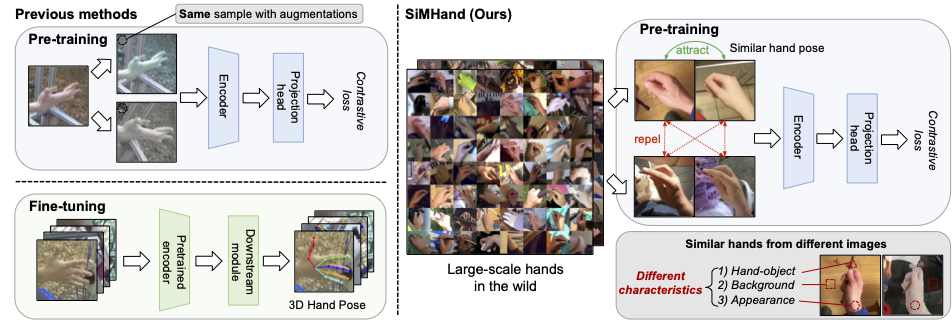

# SiMHand
---
[](https://arxiv.org/pdf/2403.04381.pdf)    

This is the official implementation of our ICLR 2025 paper "[SiMHand: Mining Similar Hands for Large-Scale 3D Hand Pose Pre-training](https://openreview.net/forum?id=96jZFqM5E0)". Hope to share our work in Singapore 🇸🇬, April, 2025～!!

[Nie Lin*](https://lin-nie.github.io/), [Takehiko Ohkawa*](https://tkhkaeio.github.io/), [Yifei Huang](https://hyf015.github.io/), [Mingfang Zhang](https://mf-zhang.github.io/), [Minjie Cai](https://cai-mj.github.io/), [Ming Li](), [Ryosuke Furuta](https://rfuruta.github.io/), [Yoichi Sato](https://sites.google.com/ut-vision.org/ysato/)
(*equal contribution). "[SiMHand: Mining Similar Hands for Large-Scale 3D Hand Pose Pre-training](https://openreview.net/forum?id=96jZFqM5E0)", [ICLR 2025](https://iclr.cc/).


## Abstract
We present a framework for pre-training of 3D hand pose estimation from in-the-wild hand images sharing with similar hand characteristics, dubbed [SiMHand](https://github.com/ut-vision/SiMHand). Pre-training with large-scale images achieves promising results in various tasks, but prior methods for 3D hand pose pre-training have not fully utilized the potential of diverse hand images accessible from in-the-wild videos. To facilitate scalable pre-training, we first prepare an extensive pool of hand images from in-the-wild videos and design our pre-training method with contrastive learning. Specifically, we collect over 2.0M hand images from recent human-centric videos, such as [100DOH](https://fouheylab.eecs.umich.edu/~dandans/projects/100DOH/) and [Ego4D](https://ego4d-data.org/). To extract discriminative information from these images, we focus on the similarity of hands: pairs of non-identical samples with similar hand poses. We then propose a novel contrastive learning method that embeds similar hand pairs closer in the feature space. Our method not only learns from similar samples but also adaptively weights the contrastive learning loss based on inter-sample distance, leading to additional performance gains. Our experiments demonstrate that our method outperforms conventional contrastive learning approaches that produce positive pairs sorely from a single image with data augmentation. We achieve significant improvements over the state-of-the-art method ([PeCLR](https://arxiv.org/pdf/2106.05953)) in various datasets, with gains of 15% on FreiHand, 10% on DexYCB, and 4% on AssemblyHands.

## Environment Set Up
Install required packages:
```bash
git clone https://github.com/ut-vision/simhand.git
cd simhand
conda env create -f environment.yml
conda activate simhand
## python -c "import torch; print(torch.__version__)" # Make sure it work!
```

## Take Away
TBD

## Run Experiments
### Prepare pre-training data
For the pre-training of [SiMHand](https://github.com/ut-vision/SiMHand), we use 2.0M in-the-wild similar hands from [Ego4D-v1](https://ego4d-data.org/) and [100DOH](https://fouheylab.eecs.umich.edu/~dandans/projects/100DOH/index.html), please follow the instruction [here](./Hand100M) to prepare the your pre-training datasets!

### Define the environment variables
```bash
export BASE_PATH='<path_to_repo>'
export COMET_API_KEY=''
export COMET_PROJECT=''
export COMET_WORKSPACE=''
export PYTHONPATH="$BASE_PATH"
export DATA_PATH="<path_to_hand100m>"
export SAVED_MODELS_BASE_PATH="$BASE_PATH/data/models/simhand"
export SAVED_META_INFO_PATH="$BASE_PATH/data/models" 
```
### SiMHand Pre-training
For pre-training of [SiMHand](https://github.com/ut-vision/SiMHand) , please run through the code below. We did not search for random augmentation strategies for SiMHand, and we inherited the description of PeCLR and SimCLR from the original PeCLR paper.
```bash
python src/experiments/main.py \
--experiment_type handclr_w \
--gpus 0,1,2,3,4,5,6,7 \ # 8 card pre-training
--color_jitter \    # Data Augmentation I
--random_crop \     # Data Augmentation II
--rotate \          # Data Augmentation III
--crop \            # Data Augmentation IV
-resnet_size 50 \   # ResNet size 50 or 152
--resize \
-sources ego4d \    # Pre-training Data Source: ego4d or 100doh
--datasets_scale 1m \   # Pre-training Data Size
-epochs 100 \
-batch_size 8192 \
-accumulate_grad_batches 1 \
-save_top_k 100 \
-save_period 1 \
-num_workers 24 \
--weight_type linear \  #  Parameter-free Adaptive Weighting Strategy
--joints_type augmented \
--diff_type mpjpe \     # Distance caculation
--pos_neg pos_neg \     # Add Weight in Pos or Neg of Contrastive Loss
```

We also prepare the [PeCLR](https://arxiv.org/pdf/2106.05953) and [SimCLR](https://arxiv.org/pdf/2002.05709) pre-training with adaptive weighting strategy: \
For PeCLR with our adaptive weighting strategy, please run:
```bash
python src/experiments/main.py \
--experiment_type peclr_w \
--gpus 0,1,2,3,4,5,6,7 \ # 8 card pre-training
--color_jitter \    # Data Augmentation I
--random_crop \     # Data Augmentation II
--rotate \          # Data Augmentation III
--crop \            # Data Augmentation IV
-resnet_size 50 \   # ResNet size 50 or 152
--resize \
-sources ego4d \    # Pre-training Data Source: ego4d or 100doh
--datasets_scale 1m \   # Pre-training Data Size
-epochs 100 \
-batch_size 8192 \
-accumulate_grad_batches 1 \
-save_top_k 100 \
-save_period 1 \
-num_workers 24 \
--weight_type linear \  #  Parameter-free Adaptive Weighting Strategy
--joints_type augmented \
--diff_type mpjpe \     # Distance caculation
--pos_neg pos_neg \     # Add Weight in Pos or Neg of Contrastive Loss
```

For SimCLR with our adaptive weighting strategy, please run:
```bash
python src/experiments/main_pretrain.py \
--experiment_type simclr_w \
--gpus 0,1,2,3,4,5,6,7 \ # 8 card pre-training
--color_jitter \    # Data Augmentation I
--crop \            # Data Augmentation II
-resnet_size 50 \
-sources ego4d \    # Pre-training Data Source: ego4d or 100doh
--datasets_scale 1m \   # Pre-training Data Si
--resize \
-epochs 100 \
-batch_size 1024 \
-accumulate_grad_batches 1 \
-save_top_k 100 \
-save_period 1 \
-num_workers 4 \
--weight_type linear \  #  parameter-free adaptive weighting strategy
--joints_type augmented \
--diff_type mpjpe \     # distance caculation
--pos_neg pos_neg     # add weight in pos or neg of Contrastive loss
```

### SiMHand Fine-tuning:
We provide the baseline model used to validate the effects of our pre-training: [minimal-hand](https://arxiv.org/pdf/2003.09572), thanks to the original author @[CalciferZh](https://github.com/CalciferZh), and @[MengHao666](https://github.com/MengHao666) for [minimal-hand](https://github.com/MengHao666/Minimal-Hand-pytorch) replication via pytorch. Since the @[MengHao666](https://github.com/MengHao666) implementation does not support several brand new datasets: FreiHands, DexYCB, Assemblyhands, please proceed directly with the newest model of minimal-hand we provide. You can find the fine-tuning model in [here](https://github.com/ut-vision/SiMHand/tree/main/minimal-hand).

## Acknowledgement
In this [SiMHand](https://github.com/ut-vision/SiMHand) project, I am grateful to all my collaborators, especially to [Take Ohkawa](https://tkhkaeio.github.io/) for his high standards and to [Yoichi Sato](https://sites.google.com/ut-vision.org/ysato/) for his patient guidance. I also would also like to thank [The University of Tokyo Scholarship](https://www.u-tokyo.ac.jp/en/prospective-students/fellowship.html) and [JST ACT-X](https://www.jst.go.jp/kisoken/act-x/) for supporting my research. Thank you!

## Citation
If you find our paper/code useful, please consider citing our paper:


```
@inproceedings{
    lin2025simhand,
    title={{SiMHand}: Mining Similar Hands for Large-Scale 3D Hand Pose Pre-training},
    author={Nie Lin and Takehiko Ohkawa and Yifei Huang and Mingfang Zhang and Minjie Cai and Ming Li and Ryosuke Furuta and Yoichi Sato},
    booktitle={The Thirteenth International Conference on Learning Representations (ICLR)},
    year={2025},
    url={https://openreview.net/forum?id=96jZFqM5E0}
}
```
