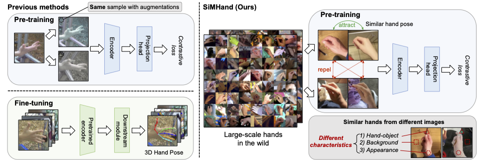

# SiMHand
This is the official implementation of our ICLR 2025 paper "[SiMHand: Mining Similar Hands for Large-Scale 3D Hand Pose Pre-training](https://openreview.net/forum?id=96jZFqM5E0)". Hope to share our work in Singapore 🇸🇬 ～!!


## Abstract
We present a framework for pre-training of 3D hand pose estimation from in-the-wild hand images sharing with similar hand characteristics, dubbed SiMHand. Pre-training with large-scale images achieves promising results in various tasks, but prior methods for 3D hand pose pre-training have not fully utilized the potential of diverse hand images accessible from in-the-wild videos. To facilitate scalable pre-training, we first prepare an extensive pool of hand images from in-the-wild videos and design our pre-training method with contrastive learning. Specifically, we collect over 2.0M hand images from recent human-centric videos, such as 100DOH and Ego4D. To extract discriminative information from these images, we focus on the similarity of hands: pairs of non-identical samples with similar hand poses. We then propose a novel contrastive learning method that embeds similar hand pairs closer in the feature space. Our method not only learns from similar samples but also adaptively weights the contrastive learning loss based on inter-sample distance, leading to additional performance gains. Our experiments demonstrate that our method outperforms conventional contrastive learning approaches that produce positive pairs sorely from a single image with data augmentation. We achieve significant improvements over the state-of-the-art method (PeCLR) in various datasets, with gains of 15% on FreiHand, 10% on DexYCB, and 4% on AssemblyHands.

Install required packages:
```bash
conda activate simhand  # simhand enviroment also support for fine-tuning!
```

## Minimal-hand

A minimal solution to hand motion capture from a single color camera at over 100fps. Easy to use, plug to run.

## Run the fine-tuning
```bash
python3 train_detnet.py \
--gpus 0 \
--backbone r50 \
--subset_ratio_train 1.0 \
--epochs 120 \
--workers 8 \
--train_batch 128 \
--test_batch 128
```

## Acknowledgment
We also thank Dr. [Takehiko Ohkawa](https://tkhkaeio.github.io/) and Dr. [Ruicong Liu](https://ruicongliu.github.io/) for implementing the minimal-hand DexYCB and Assemblyhand dataloader!

## Citation
If you find our paper/code useful, please consider citing our paper:


```
@inproceedings{
    lin2025simhand,
    title={{SiMHand}: Mining Similar Hands for Large-Scale 3D Hand Pose Pre-training},
    author={Nie Lin and Takehiko Ohkawa and Yifei Huang and Mingfang Zhang and Minjie Cai and Ming Li and Ryosuke Furuta and Yoichi Sato},
    booktitle={The Thirteenth International Conference on Learning Representations (ICLR)},
    year={2025},
    url={https://openreview.net/forum?id=96jZFqM5E0}
}
```


And if you also use the minimal-hand model, please cite the paper:
```
# minimal-hand model:
@InProceedings{zhou2020monocular,
  author = {Zhou, Yuxiao and Habermann, Marc and Xu, Weipeng and Habibie, Ikhsanul and Theobalt, Christian and Xu, Feng},
  title = {Monocular Real-Time Hand Shape and Motion Capture Using Multi-Modal Data},
  booktitle = {IEEE/CVF Conference on Computer Vision and Pattern Recognition (CVPR)},
  month = {June},
  year = {2020}
}
```

If you also find [Hao Meng](https://menghao666.github.io/)'s project helpful, please star this project and cite them:
```
@article{meng2022hdr,
  title={3D Interacting Hand Pose Estimation by Hand De-occlusion and Removal},
  author={Hao Meng, Sheng Jin, Wentao Liu, Chen Qian, Mengxiang Lin, Wanli Ouyang, and Ping Luo},
  booktitle={European Conference on Computer Vision (ECCV)},
  year={2022}
  month={October},
}
```